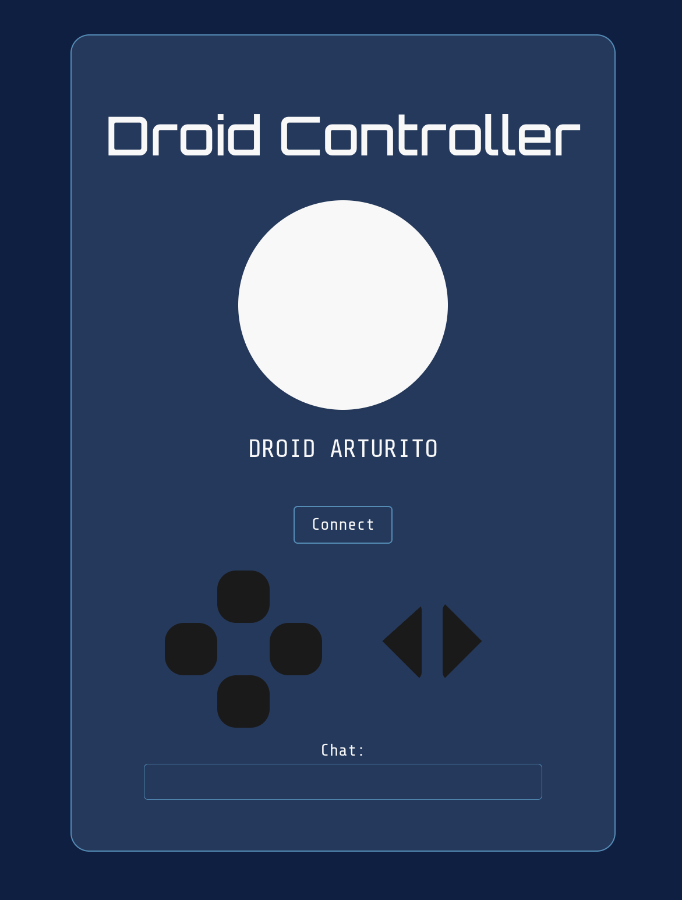

# 🛠 Droid Controller

> ⚠️ *Disclaimer: This project is just for fun and does **not** reverse-engineer or modify Disney’s official droids.*

🚧 **Project Status**: Work in progress  


The **Droid Controller** is a web application that connects to and controls Disney's astromech droids — the kind you might build at **Galaxy’s Edge** in Hollywood Studios.

With this app, you can:
- 🔁 Connect to your nearby droid via Bluetooth
- 🎮 Send basic movement commands
- 💬 Chat with your droid and receive interactive responses through **motions and sounds**

In the future, I plan to experiment with Arduino sensors to enable new types of interaction, and improve the LLM integration for smarter, more responsive conversations.

---

## Tech Stack

- **Frontend**: React.js (with Vite)
- **Backend**: Flask (Python)
- **LLM Integration**: Locally running [Ollama](https://ollama.com/) using **LLaMA 3.3**

---

## Setup Instructions

### 1. Backend (Python + Flask)

Create and activate a virtual environment:

```bash
cd backend
uv venv
source .venv/bin/activate
uv pip install -r pyproject.toml
uv sync
uv run
```

## References 
https://medium.com/@baptistelaget/controlling-disneys-droids-from-droid-depots-with-webbluetooth-febbabe50587
